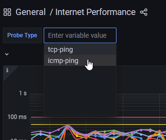
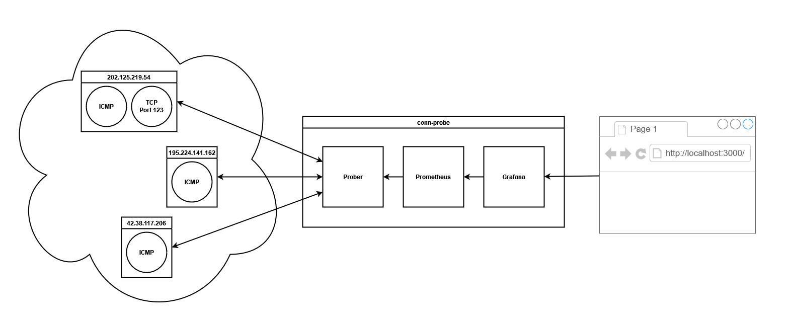

# conn-probe


conn-probe shows you the performance of your internet connection by routinely pinging
hosts around the web, storing the results, and finally visualizing that data on a graphing
dashboard. That way, you can see things like:

- latency (how long it takes for a packet to arrive somewhere and another to come back)
- jitter (the variance of latency)
- packet loss/outages (expected packets that never arrive)

Use this to get a quantitative idea about your connection, so you can complain with
confidence to your ISP.

**New!** conn-probe will also gather modem information from an
[Arris S33 router](https://www.surfboard.com/products/cable-modems/s33/) and visualize things like
uncorrectable codewords and signal-to-noise ratio.

## Quickstart

1. Ensure you have [Docker Desktop](https://www.docker.com/products/docker-desktop)
   and [git](https://git-scm.com/downloads) on your system.

2. Clone this repository:

   ```shell
   git clone https://github.com/t-mart/conn-probe.git
   ```

3. Start the application:

   ```shell
   cd conn-probe/
   docker compose up --detach --build --always-recreate-deps
   ```

4. Head to the dashboard at <http://localhost:3000/d/internet-performance/internet-performance>
   *(and the modem dashboard at <http://localhost:3000/d/modem-info/modem-info>)*.

   The dashboard may initially show "No Data" because the first metrics are making their way to
   Grafana. Just wait and/or reload the page. "No Data" may continue to show for the Failure graphs,
   which is a good thing because you haven't experienced any yet!

## Probes

Probes are what I'm calling the way that you can measure your connection. (You may also think of
them as "pings".) Simply put, they're little pieces of code that return the number of seconds they
take to perform some networking task or if a failure/timeout was experienced.

conn-probe fires off probes every **15 seconds**.

conn-probe supports currently supports two types of probes:

- ICMP ping probes (`icmp-ping`) measure how long it takes for a host to reply to an ICMP request.
- TCP ping probes (`tcp-ping`) measure how long it takes for a host to reply to a `SYN` TCP packet
  on a particular port with a response, usually a `SYN-ACK`, but any response indicates liveness.
  These are the first two steps of the
  [TCP 3-step handshake](https://developer.mozilla.org/en-US/docs/Glossary/TCP_handshake).
  No data is otherwise transfered.

You can change which type of probe you are viewing in the dashboard with the dropdown box in the
upper left:



## Configuration

The conn-probe configuration file specifies how it runs.

A default configuration is given at [config.yml](config.yml) and this file will be automatically
used in the Docker Compose application. You may edit it at will.

Configuration is read once when the application starts. So, to update the configuration, restart the
application.

The schema for `config.yml` is demonstrated by this example:

```yaml
probes:
  - host: "1.2.3.4"
    type: icmp-ping
  - host: "google.com"
    type: tcp-ping
    port: 80

modems:
  - host: 192.168.100.1
    password: "the password"
```

- `probes`: list, required
  - `probes` item: object, optional. Groups parameters related to a probe.
    - `host`: string, required. Specifies a host. Can be an IP or domain name.
    - `type`: string, required. May be either `icmp-ping` or `tcp-ping` for behavior as described
      above.
    - `port`: integer between 0 and 65,535, required if `type` == `tcp-ping`. Specifies the
      destination port on which to connect to `host`.
- `modems`: list, required
  - `modems` item: object, optional. Groups parameters related to a modem.
    - `host`: string, required. Specifies where to find the modem information page of an Arris
      S33 router.
    - `password`: string, required. Specifies the login password.

Validation of the configuration is minimal for now, and if you mess up, conn-probe may give you an
error message or may just barf.

### Default Probe Hosts

To get an idea of the general performance of your internet connection, a wide variety of hosts
should be used that fit the following criteria:

- They should be generally accessible (not behind firewalls, in private IP space, etc)
- They should respond to the types of probes we are interested in issuing, such as ICMP or TCP
- They should be addressable by IP so that we don't incur any DNS lookup costs in our probes.

A good candidate set that fulfills these criteria are, in my opinion, DNS providers. Therefore, the
default configuration is preloaded with a set of them (along with comments explaining what they
are).

## Retention

By default, conn-probe's VictoriaMetrics (Prometheus) server retains data for at most 30 days.

If you wish to change that, update the `-retentionPeriod` option of the VictoriaMetrics
service in the [docker-compose.yml](docker-compose.yml) file. See
<https://docs.victoriametrics.com/?highlight=retention#retention> for more details.

Also, do note that the metrics data is stored in a Docker volume, allowing you to start/stop and
recreate the containers without data loss.

## Backing Up and Restoring Metrics Data

- To backup metrics, run `make backup-metrics` and a new file `metrics.tar.gz` will be created in
  the project root directory.
- To restore metrics, run `make restore-metrics`, which will restore from `metrics.tar.gz` in the
  project root directory.

## Development

### Architecture



### Grafana

The Grafana dashboards should be periodically exported with `make export-grafana` and
committed. Requires `curl` and `jq`.
